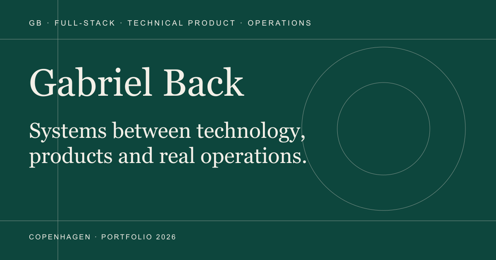

<div align="center">

# Gabriel Back — CV & Portfolio

An interactive portfolio covering my background, work, technical skills and selected products.

## [View the live site →](https://goprogabriel.github.io/cv/)

[Projects](https://goprogabriel.github.io/cv/projects/) · [English CV](https://goprogabriel.github.io/cv/en/) · [Danish CV](https://goprogabriel.github.io/cv/)



</div>

## What the site contains

The main portfolio is a visual CV with:

- a short profile and personal introduction;
- an interactive career timeline;
- work experience and two detailed professional cases;
- shipped apps and operational tools;
- technical skills, photographs and direct contact details;
- Danish and English versions;
- browser-friendly and downloadable print CVs.

The separate English project directory presents eight pieces of work: Open Dictate, BUSBUS, PartyPal, Sidste Runde, the Nomad CRM, Nomad Properties, Flower and GetTestedNow. Every entry is a self-contained overview with a real product image, a short description, my contribution and the relevant technology.

## Design and interaction

The site uses an editorial visual system built around large serif type, dark green surfaces and compact technical details. Motion is used for section reveals, image parallax, scroll progress, the draggable career orbit, project rails and small interface responses.

The layout has dedicated mobile behaviour rather than simply shrinking the desktop version. Dense sections collapse into readable lists, project cards become a single column, skill navigation becomes swipeable and touch targets remain usable. Reduced-motion preferences are respected throughout.

## Routes

| Route | Purpose |
| --- | --- |
| `/cv/` | Danish portfolio |
| `/cv/en/` | English portfolio |
| `/cv/projects/` | English project directory |
| `/cv/print/` | Danish print view |
| `/cv/en/print/` | English print view |

## Built with

Astro 5, TypeScript, semantic HTML, modern CSS and GSAP. The output is a static site with no client-side framework runtime, backend or contact form.

## Local development

Node.js 22 or newer and pnpm are required.

```bash
pnpm install
pnpm dev
```

Open `http://localhost:4321`. Run the full check before publishing:

```bash
pnpm verify
```

To build the same `/cv/` paths used by GitHub Pages:

```bash
SITE_URL=https://goprogabriel.github.io BASE_PATH=cv pnpm build
pnpm preview
```

## Editing the portfolio

Most copy and project data lives in `src/content/`, separate from the Astro components:

- `profile.ts` — introduction and personal details;
- `experience.ts` — roles and professional cases;
- `projectShowcase.ts` — the eight entries on the project directory;
- `projects.ts` — the shorter project selection on the CV;
- `skills.ts`, `education.ts` and `socials.ts` — supporting CV content;
- `site.ts` — site metadata and navigation labels.

Images and downloadable CV files live in `public/media/` and `public/documents/cv/`.

## Deployment

The workflow in `.github/workflows/deploy.yml` checks and builds the site whenever `main` is updated, then publishes the static output to GitHub Pages.

Repository: [github.com/Goprogabriel/cv](https://github.com/Goprogabriel/cv)

## Contact

[Email](mailto:gaphbahe@gmail.com) · [LinkedIn](https://www.linkedin.com/in/gabrielback/) · [GitHub](https://github.com/Goprogabriel)
